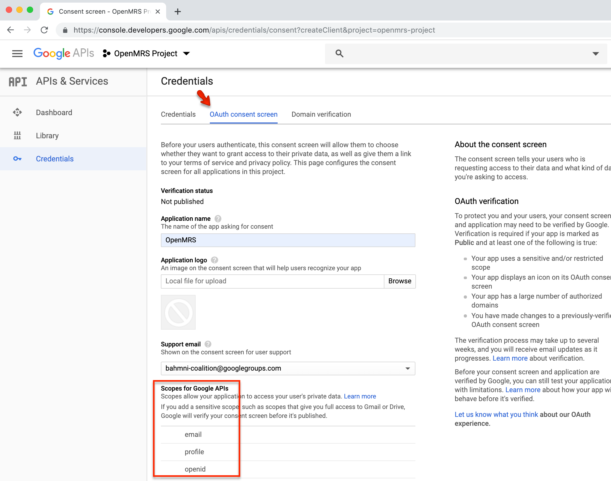
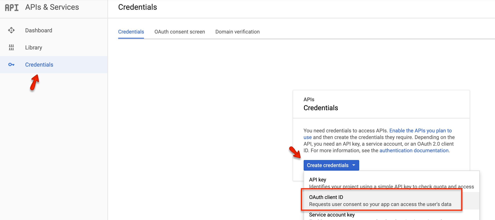
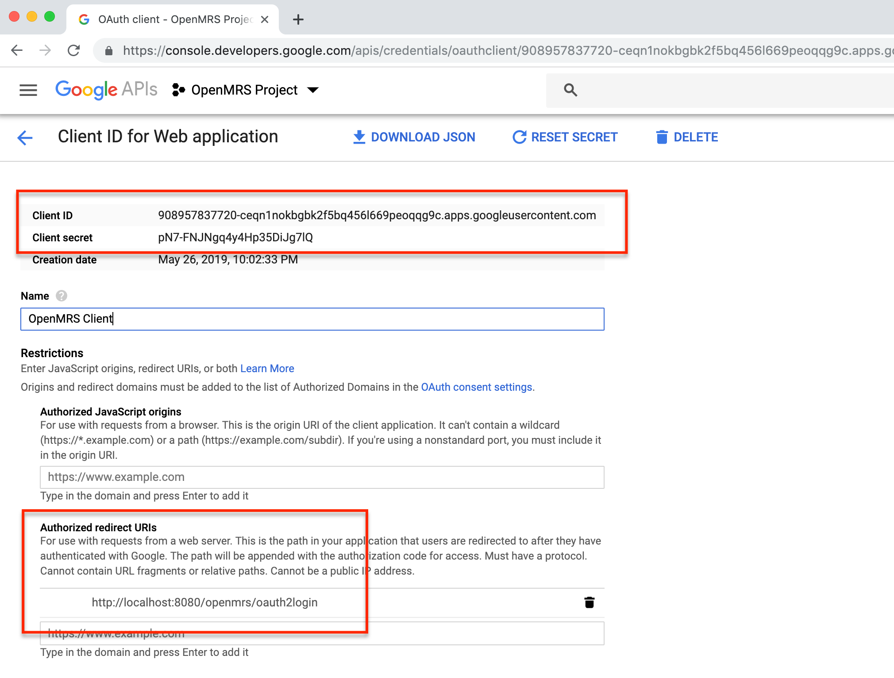
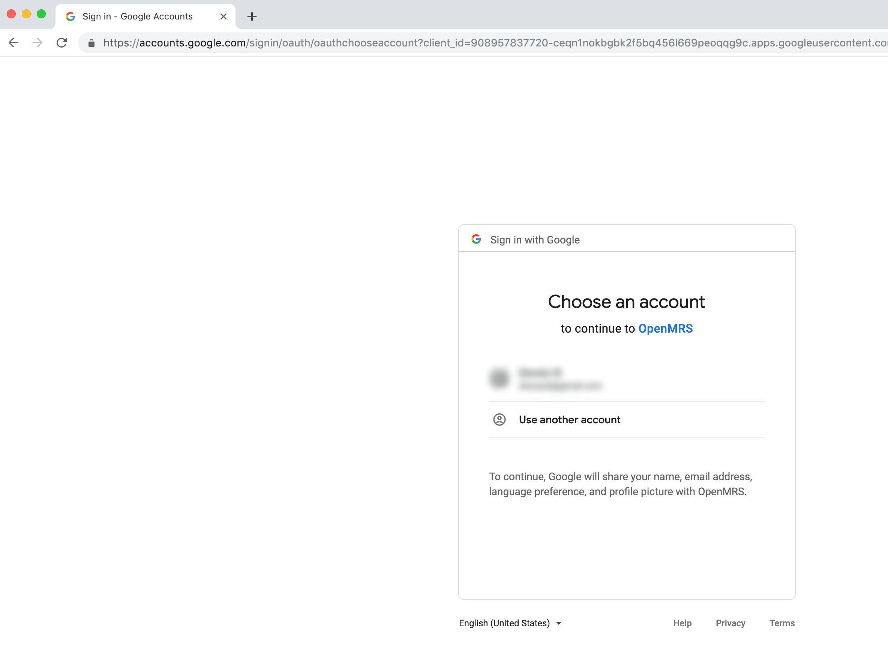
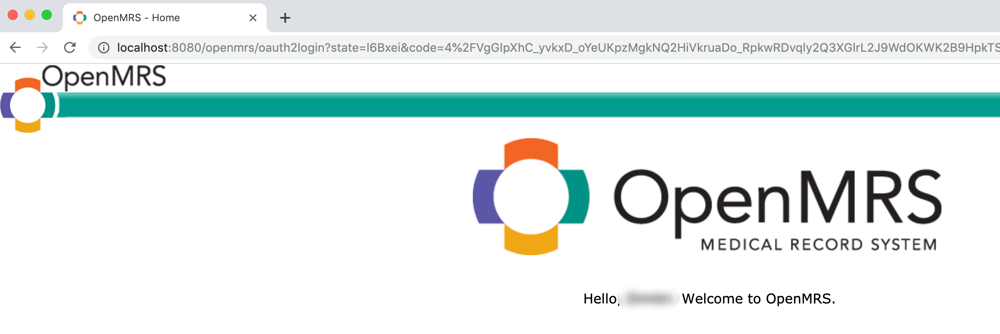

# Google API Configuration Guide

>This guide is based on Google API as of **June 2019**

## Step by Step Guide

Three steps are needed:
1. **Create a Google API project.**
1. **Set up the OAuth consent screen.**
    * It is the Google-equivalent to a login page. The consent screen is more than a login page in the sense that even when you are already logged in Google may ask you to consent for OpenMRS to access scopes of your Google user account.
1. **Create OAuth client ID credentials.**
    * Those will provide the client ID and client secret for our OAuth 2 properties file.

### 1. Create a Google API project

First you will need a _project_, if you have not created one yet go to [https://console.developers.google.com](https://console.developers.google.com) and create one:


### 2. Configuring the Consent Screen for your project

There is almost nothing to do here. Note how the scopes email, profile and openid are included by default.


### 2. Creating OAuth client ID credentials

Click on Credentials on the left menu to create the OAuth 2 client ID:



Choose 'Web application' and make sure to supply the correct redirect URL to the OpenMRS instance that we will assume to be running at `http://localhost:8080/openmrs`.

You will finally get your client ID and client secret for our OAuth 2 properties file by reopening the credentials in edit mode. Here is what your credentials should look like in the end:



In particular pay attention to the redirect URL that must be `http://localhost:8080/openmrs/oauth2login`.

## Setting Up oauth2.properties

We know what the client ID and secret are:
```
clientId=908957837720-ceqn1nokbgbk2f5bq456l669peoqqg9c.apps.googleusercontent.com
clientSecret=pN7-FNJNgq4y4Hp35DiJg7lQ
```
The user authorization URI, access token URI and user info URI are
```
userAuthorizationUri=https://accounts.google.com/o/oauth2/v2/auth
accessTokenUri=https://www.googleapis.com/oauth2/v4/token
userInfoUri=https://www.googleapis.com/oauth2/v3/userinfo
```
And the scopes needed for authentication are:
```
scope=https://www.googleapis.com/auth/userinfo.email,https://www.googleapis.com/auth/userinfo.profile
```
Best is to track the module test resources for OAuth 2 properties sample files. Google API test resources can be found [here](../omod/src/test/resources/GoogleAPI).

## Running OpenMRS
After all the above is set running OpenMRS will prompt the consent screen before let you through to OpenMRS:



And eventually you will be logged into OpenMRS as your Google account user:



Logging in a system admin will show that your Google account user was created in accordance the user info provided by Google API.

Note that email addresses cannot be used as username in OpenMRS, so in order to ensure uniqueness it is the **subject** of the user info response that is used as the username. This subject is unique numeric identifier for the Google user account.

