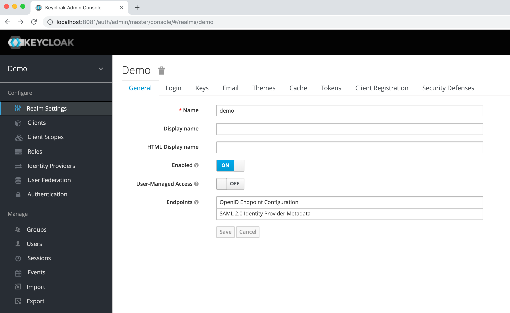
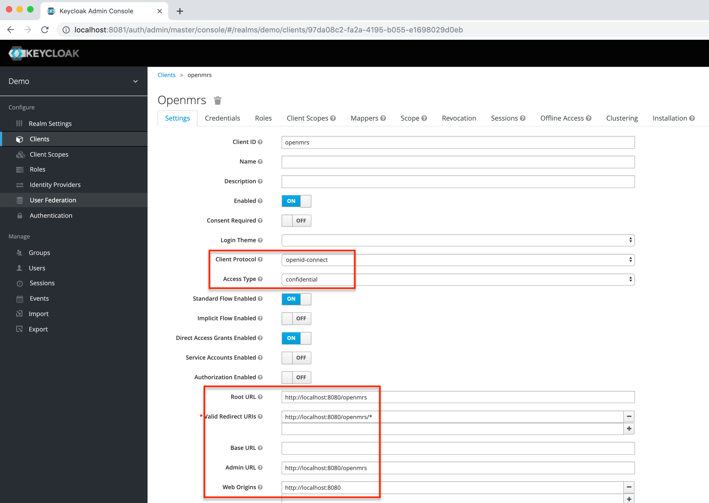
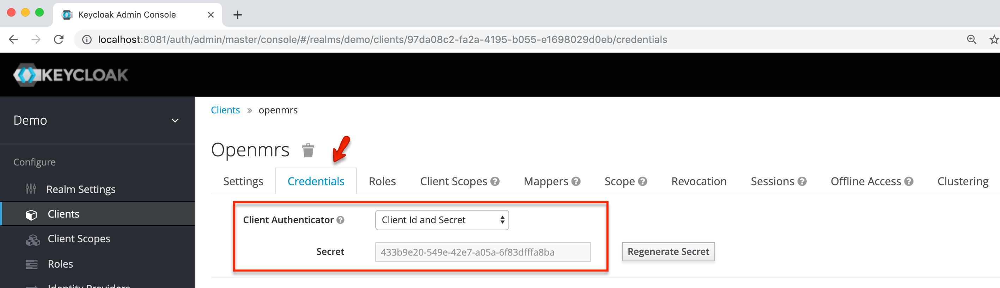
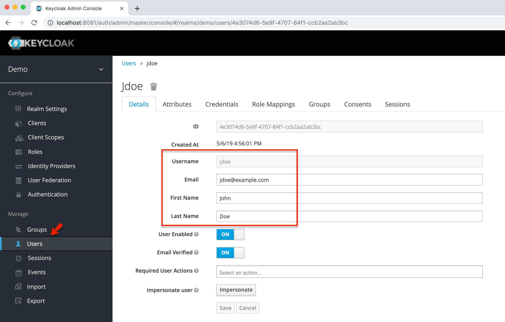
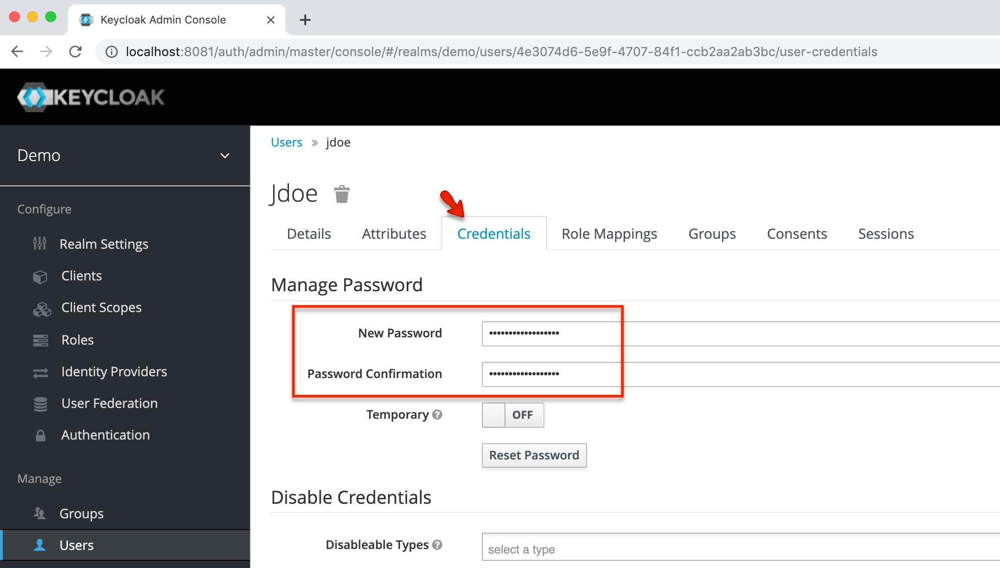
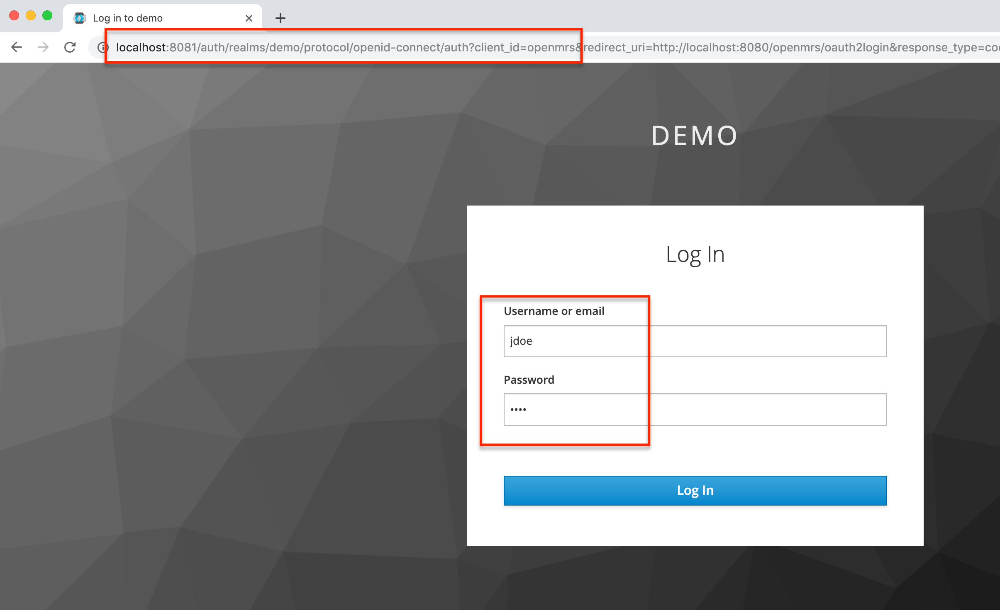
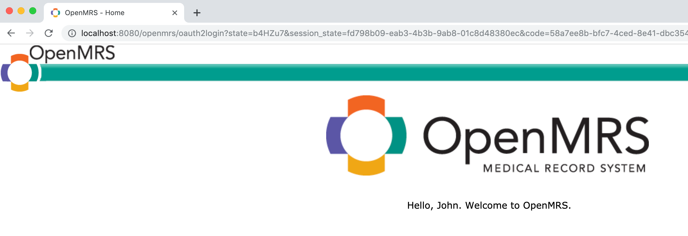
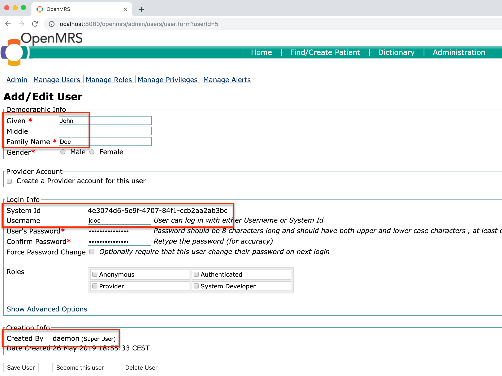

# Keycloak Configuration Guide

>This guide is based on **Keycloak 6.0**

We strongly suggest to use Keycloak's Docker image for trial purposes. In our demo we have mapped its default 8080 port to 8081 on the host:
```bash
docker run -p 8081:8080 jboss/keycloak
```
It can therefore be accessed at `http://localhost:8081`, and we will assume that OpenMRS runs on port 8080: `http://localhost:8080/openmrs`

----

Keycloak ships by default with a _master_ realm. Do not use that one for managing your OpenMRS users, rather create a new ad-hoc realm. For the sake of this guide we will name it _demo_:



On our new demo realm we must add a new client for OpenMRS and we shall specify that the root URL is that of OpenMRS:



Once the new client is created the client secret can be obtained from the Credentials tab:



We have set the client ID to be `openmrs` and the client secret has been generated to be `433b9e20-549e-42e7-a05a-6f83dfffa8ba`, those will have to be specified in the OAuth 2 properties file:
```
clientId=openmrs
clientSecret=433b9e20-549e-42e7-a05a-6f83dfffa8ba
```

There is a convenient way to find out all the URIs that need to be known, just navigate here: `http://localhost:8081/auth/realms/demo/.well-known/openid-configuration`. There we can find the user authorization URI, the access token URI and the user info URI to be:
```
userAuthorizationUri=http://localhost:8081/auth/realms/demo/protocol/openid-connect/auth
accessTokenUri=http://localhost:8081/auth/realms/demo/protocol/openid-connect/token
userInfoUri=http://localhost:8081/auth/realms/demo/protocol/openid-connect/userinfo
```
Keycloak is now set up with a demo realm and a client for OpenMRS. We can add users that once logged within Keycloak will automatically be authorized to log into OpenMRS.



The username is set when creating the user and the password is set in the Credentials tab:



Before starting OpenMRS with the OAuth 2 Login module we need to copy the OAuth 2 properties file in OpenMRS' app data directory. We need the appropriate mappings to make this work with Keycloak:
```
openmrs.mapping.user.username=preferred_username
openmrs.mapping.person.givenName=given_name
openmrs.mapping.person.familyName=family_name
openmrs.mapping.user.email=email
openmrs.mapping.user.systemId=sub
```
Once OpenMRS has started, attempting to load it will redirect to Keycloak's login page to be filled with the test user credentials:



After authenticating with Keycloak the user is redirected to a logged in OpenMRS session.



Best is to track the module test resources for OAuth 2 properties sample files. Keycloak test resources can be found [here](../omod/src/test/resources/Keycloak).

When logged in as a system admin we can verify that a new user was created appropriately based on Keycloak's user info:

